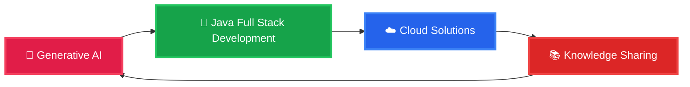

<!-- Header with animated typing effect -->
<div align="center">
  
</div>

<!-- Professional Banner -->
<div align="center">
  
</div>

---

## 🚀 About Me

<div align="center">
  <p>
    
    
    
    
  </p>
</div>

Software Engineer with **3+ years of professional experience** building **backend-heavy, full-stack systems** in enterprise environments.

I work on **production-grade services**, clean APIs, platform upgrades, and systems that need to scale without breaking.  
Most of my experience comes from working close to **real users, real data, and real SLAs**.

---

<!-- Quote Section -->
<div align="center">
  
</div>

---

## 💡 What Drives Me

```java
public class GouravBhatia {

    String role = "Software Engineer";
    String experience = "3+ years";
    String focus = "Backend-heavy Full Stack Systems";

    List<String> coreSkills = List.of(
        "Java & Spring Boot",
        "Node.js & REST APIs",
        "Microservices",
        "Angular & React",
        "Kubernetes & Docker",
        "Production Support"
    );

    List<String> currentLearning = List.of(
        "Generative AI integration",
        "RAG architectures",
        "Model Context Protocol (MCP)",
        "Spring AI"
    );

    String philosophy = 
        "Build systems where backend reliability and frontend clarity " +
        "come together to work well in production.";

    void dailyRoutine() {
        System.out.println("☕ Debug");
        System.out.println("🔧 Build APIs");
        System.out.println("🖥️ Improve UI flows");
        System.out.println("🚀 Ship to production");
        System.out.println("📈 Iterate based on real usage");
    }
}
```
---

## 🎯 What I Do
<div align="center">
    <table>
        <tr>
            <td align="center" width="33%">
                
                <h3>🔧 Backend Engineering</h3>
                <p>Designing and building microservices and REST APIs that scale and survive production traffic.</p>
            </td>
            <td align="center" width="33%">
                
                <h3>☁️ Platform & DevOps</h3>
                <p>Deploying, upgrading, and operating services on Kubernetes with reliability in mind.</p>
            </td>
            <td align="center" width="33%">
                
                <h3>🤖 AI Integration</h3>
                <p>Learning how to integrate GenAI into backend systems using RAG, MCP, and Spring AI.</p>
            </td>
        </tr>
    </table>
</div>

---

## 🛠️ Tech Arsenal

<div align="center">

### 💻 Languages & Frameworks


### 🗄️ Databases & Storage


### ☁️ Cloud & DevOps


### 🔧 Tools & Technologies


### 🤖 AI (Learning & Applying)


</div>

---

## 🌐 Connect & Follow My Journey

<div align="center">
  
### 📱 Social Media
[](https://www.linkedin.com/in/gouravbhatia2000/)
[](https://www.instagram.com/_gourav_bhatia)
[](https://leetcode.com/gxrv07/)

### 📧 Let's Collaborate
[](mailto:gourav.bhatia639@gmail.com)

</div>

---

## 🎯 Current Focus



---

## 💡 Philosophy

<div align="center">
  <a href="https://github.com/piyushsuthar/github-readme-quotes">
    
  </a>
</div>

> **"If it's structured, it can be automated"** - This drives my approach to solving complex problems through elegant, scalable solutions.

---

<div align="center">
  
  
  ### 🚀 Ready to build something amazing together?
  
  
  
  **⭐ Star my repositories if you find them helpful!**
  
</div>
